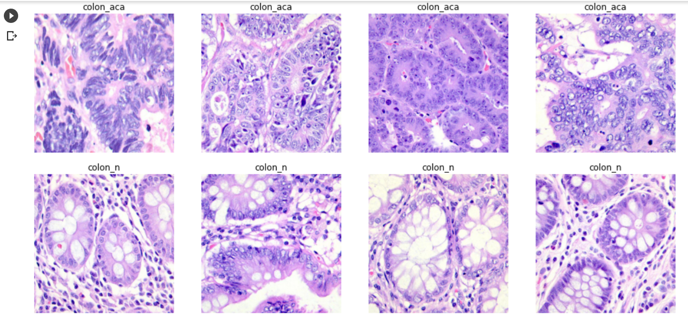

# Colon Cancer Classification using CNN

Praktikum Machine Learning A 201810370311285 & 201810370311283
Temu Kembali Citra A 201810370311285 & 201810370311283

Link Dataset : https://www.kaggle.com/andrewmvd/lung-and-colon-cancer-histopathological-images

## Konten
* [Informasi](#general-information)
* [Library](#technologies-used)
* [Features](#features)
* [Screenshots](#screenshots)
* [Setup](#setup)
* [Model](#model)
* [Project Status](#project-status)
* [Room for Improvement](#room-for-improvement)
* [Acknowledgements](#acknowledgements)
* [Contact](#contact)
<!-- * [License](#license) -->

## General Information
- Dataset yang digunakan berjudul "Lung and Colon Cancer Histopathological Images" yang merupakan dataset citra.
- Jumlah dataset 25000.
- Terbagi dalam 5 class

<!-- You don't have to answer all the questions - just the ones relevant to your project. -->

## Library
- Tensorflow 2.0
- Keras
- Matplotlib
- Numpy
- Glob
- seaborn

## Features
#Kelas datasetnya meliputi : 
- Lung benign tissue
- Lung adenocarcinoma
- Lung squamous cell carcinoma
- Colon adenocarcinoma
- Colon benign tissue

## Screenshots

<!-- If you have screenshots you'd like to share, include them here. -->

## Setup
- prepocessing step :
* Splitting data 80:19:1 (80 train, 19 test, 1 validation)
- Augmentation :
* ImageDataGenerator : 
** rescale : 1/255
** rotation range : 40
** width and height shift range : 0.2
** zoom range : 0.2
** horizontal flip
** fill mode : nearest
** color mode : RGB

## model
- model sequential 1 : layer, Dense, Conv2D, MaxPool2D, AveragePooling2D, GlobalMaxPool2D, GlobalAveragePooling2D, Dropout, Flatten
- Activation : relu

- model sequential 2 : Layer, Dense, Conv2D, AveragePool2D, Flatten, BatchNormalization, Dropout, AveragePool2D
- Activation : relu
`model = Sequential()`

`model.add(InputLayer(input_shape=[250,250,3]))`
`model.add(Conv2D(filters=16, kernel_size=3, strides=1, padding='same', activation='relu'))`
`model.add(MaxPool2D(pool_size=2, padding='same'))`
`model.add(Conv2D(filters=32, kernel_size=3, strides=1, padding='same', activation='relu'))`
`model.add(MaxPool2D(pool_size=2, padding='same'))`
`model.add(Conv2D(filters=64, kernel_size=3, strides=1, padding='same', activation='relu'))`
`model.add(MaxPool2D(pool_size=2, padding='same'))`
`model.add(GlobalMaxPool2D())`
`model.add(Flatten())`

`model.add(Dense(128, activation='relu'))`
`model.add(Dense(1, activation='sigmoid'))`

## Project Status
Project is: _in progress_ / _complete_ / _no longer being worked on_. If you are no longer working on it, provide reasons why.

## Room for Improvement
Include areas you believe need improvement / could be improved. Also add TODOs for future development.

Room for improvement:
- Improvement to be done 1
- Improvement to be done 2

To do:
- Feature to be added 1
- Feature to be added 2

## Acknowledgements
Give credit here.
- This project was inspired by author= {Andrew A. Borkowski, Marilyn M. Bui, L. Brannon Thomas, Catherine P. Wilson, Lauren A. DeLand, Stephen M. Mastorides},
url= (https://github.com/tampapath/lung_colon_image_set).
- This project was based on [Dataset BibTeX](https://github.com/tampapath/lung_colon_image_set).
- Many thanks to...

<!-- Optional -->
<!-- ## License -->
<!-- This project is open source and available under the [... License](). -->

<!-- You don't have to include all sections - just the one's relevant to your project -->
